<p align="center">
  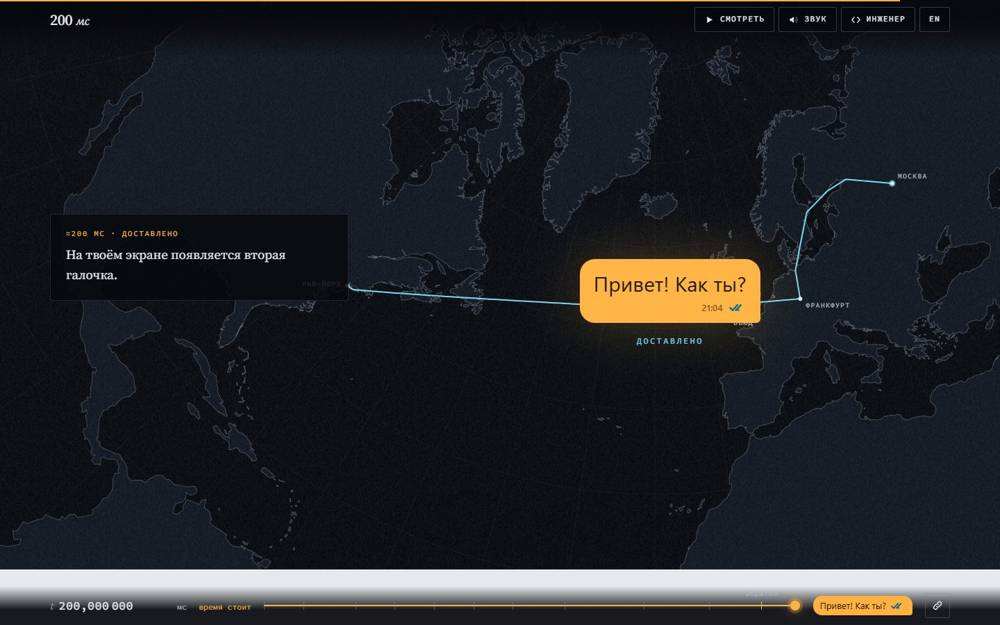
</p>

# 200 мс — путь одного сообщения из Москвы в Нью-Йорк

> Интерактивная история о том, что происходит между «Отправить» и «Доставлено». Прокрутка управляет временем: 200 миллисекунд растянуты на семь минут чтения, а в самых быстрых местах замедлены в десятки миллионов раз.


**Главное:**
- **Прокрутка — это часы.** Каждой позиции скролла соответствует момент истории с точностью до наносекунды, а коэффициент замедления пересчитывается каждый кадр: от десятков раз на обратном пути до ×68 000 000 в сцене, где радиоволна за 33 нс долетает до роутера.
- **Сообщение настоящее.** Текст, который пишет читатель, кодируется в UTF-8 и шифруется AES-256-GCM прямо в браузере через `crypto.subtle`. Импульсы света в оптоволокне — биты этого шифротекста, размеры пакета посчитаны от его длины.
- **Факты сверены с источниками.** Тайминги построены из скорости света в стекле, реальной географии и типичных задержек оборудования, 16 источников перечислены на самой странице. Звук генерируется Web Audio без единого аудиофайла, вся история — один HTML-файл.

## Идея

Сообщение в мессенджере доходит до другого континента быстрее, чем человек моргает, поэтому кажется, что между нажатием кнопки и галочкой ничего не происходит. «200 мс» раскладывает эти две десятых секунды на одиннадцать глав: касание экрана, кодировка, шифр, сетевые заголовки, радиоэфир, оптоволокно, эстафета маршрутизаторов, точка обмена трафиком во Франкфурте, подводный кабель через Атлантику, Нью-Йорк и путь подтверждения обратно.

Главный герой — сообщение самого читателя. В начале он пишет Ане в Нью-Йорк и угадывает, сколько будет лететь текст. Дальше история следит за каждым байтом именно этого текста, а в Нью-Йорке и в финале догадку сверяют с моделью. Метафора — замедленная съёмка: прокрутка двигает кадр, а цифра в HUD показывает, во сколько раз сейчас замедлено время.

История рассчитана на любопытного читателя без инженерного образования, а для инженеров есть «режим инженера» со сносками про CSMA/CA, показатель преломления, BGP и размеры заголовков. Как проект для портфолио она показывает редакционный скроллителлинг, визуализацию на Canvas, работу с картографическими проекциями, генеративный звук и аккуратное обращение с фактами.

## Скриншоты

<table>
  <tr>
    <td width="50%" valign="top">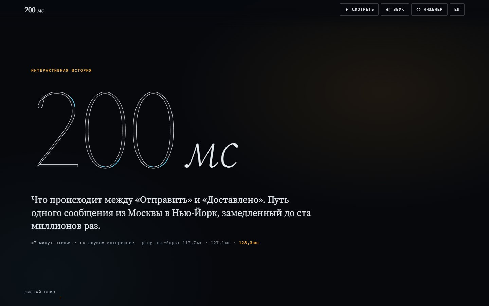<br><sub>Начало истории</sub></td>
    <td width="50%" valign="top">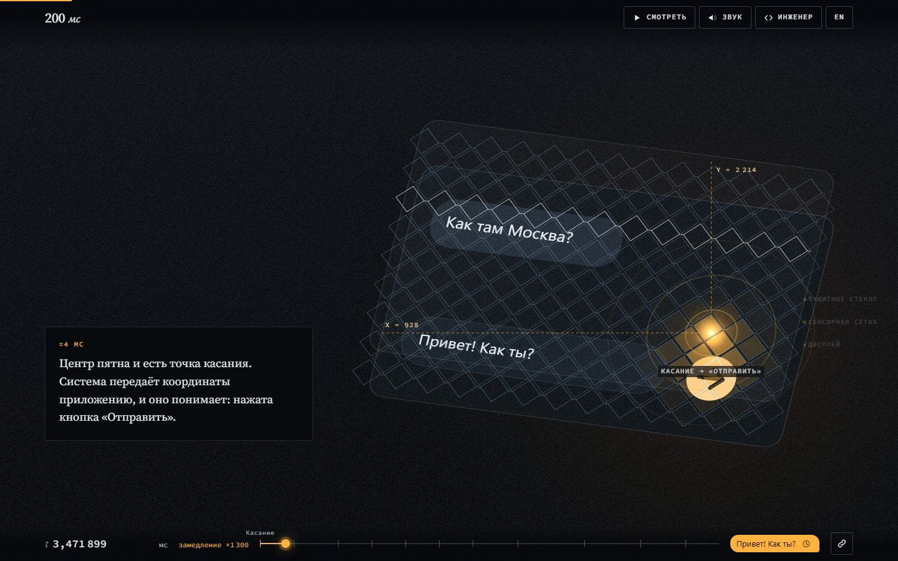<br><sub>Касание экрана</sub></td>
  </tr>
  <tr>
    <td width="50%" valign="top">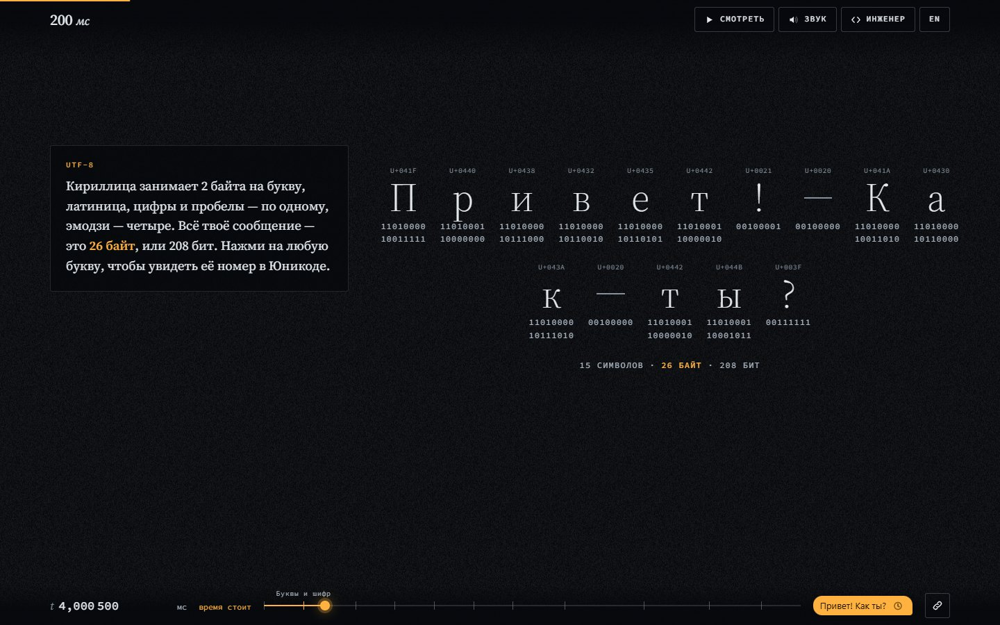<br><sub>Сообщение в байтах UTF-8</sub></td>
    <td width="50%" valign="top">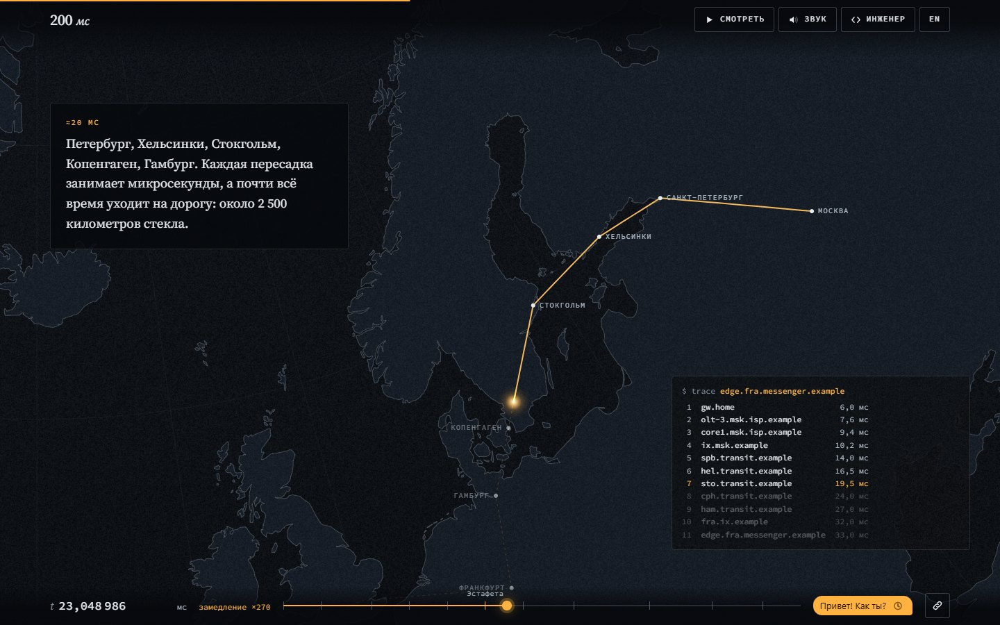<br><sub>Маршрут через Европу</sub></td>
  </tr>
  <tr>
    <td width="50%" valign="top">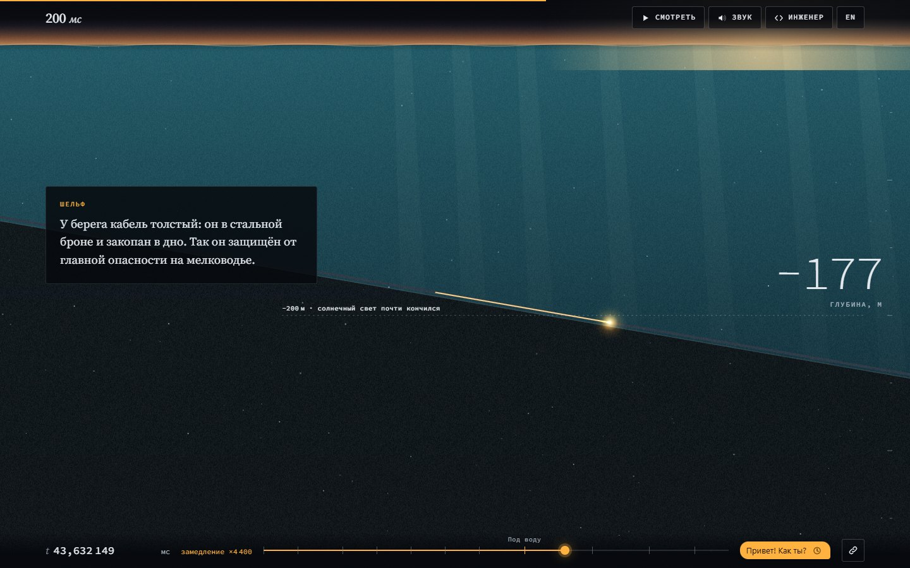<br><sub>Погружение: кабель на дне океана</sub></td>
    <td width="50%" valign="top">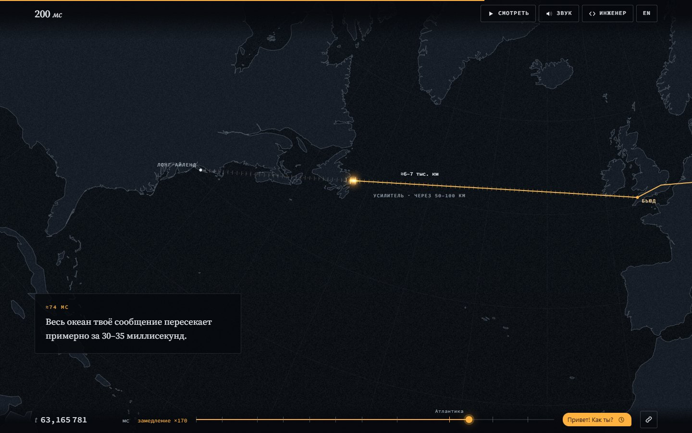<br><sub>Через Атлантику</sub></td>
  </tr>
  <tr>
    <td width="50%" valign="top">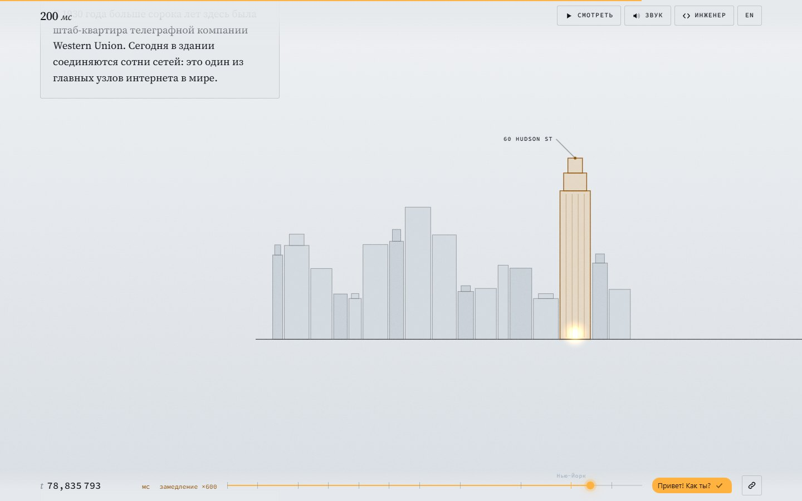<br><sub>Нью-Йорк</sub></td>
    <td width="50%" valign="top">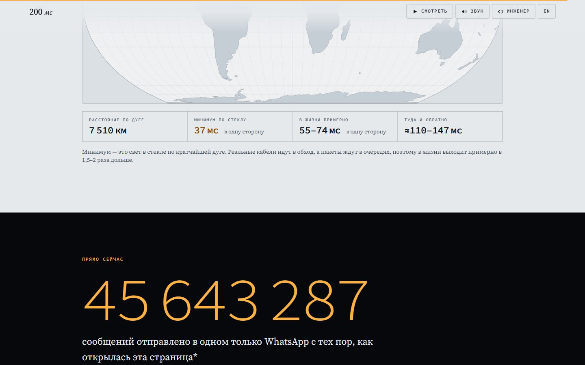<br><sub>Счётчик сообщений, отправленных с момента открытия страницы</sub></td>
  </tr>
</table>

<p align="center">
  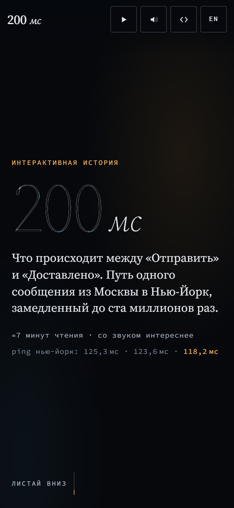
  <br><sub>Мобильная версия</sub>
</p>

## Возможности

### Пролог
- **Заставка.** Контурная цифра «200», по контуру которой бегут два сигнала: янтарный (сообщение) и голубой (подтверждение). Рядом — имитация пинга до Нью-Йорка.
- **Чат с Аней.** Макет телефона с перепиской: можно стереть готовую фразу и написать свою, до 32 символов (эмодзи считается одним символом). Отправка запускает историю.
- **Угадайка.** Логарифмический ползунок от 1 мс до 10 с с «круглыми» значениями. Ответ запоминается и сверяется в Нью-Йорке, в финале и на открытке.

### Одиннадцать глав

| № | Глава | Время истории | Что на экране |
|---|---|---|---|
| 1 | Касание | 0 → 4 мс | Экран раскладывается в изометрии на стекло, сенсорную сетку и дисплей; контроллер сканирует строки, в месте касания проступает матрица изменения ёмкости, затем координаты нажатия |
| 2 | Буквы и шифр | 4 → 4,002 мс | Каждая буква сообщения — кнопка с кодовой точкой Юникода и байтами UTF-8; биты перемешиваются в настоящий шифротекст, показаны nonce и тег аутентификации |
| 3 | Конверты | 4,002 → 4,008 мс | Вложенные слои TLS, TCP, IP и Wi‑Fi с размерами; по клику открывается содержимое заголовка; полоса «слова / служебное» с долей полезной нагрузки |
| 4 | Эфир | 4,008 → 6 мс | Телефон слушает эфир среди соседских сетей и ждёт паузы; волна 5 ГГц с лупой λ = 6 см проходит 10 метров за 33 нс |
| 5 | Свет | 6 → 10 мс | Срез волокна (покрытие 250 мкм, оболочка 125 мкм, сердцевина ≈9 мкм) рядом с волосом; импульсы в волокне — первые 16 байт шифротекста; линейка «1 м стекла ≈ 5 нс» |
| 6 | Эстафета | 10 → 33 мс | Карта: Москва — Петербург — Хельсинки — Стокгольм — Копенгаген — Гамбург — Франкфурт, камера летит за пакетом; терминал `trace` на 11 хопов |
| 7 | Франкфурт | 33 → 36 мс | Точка обмена трафиком со 150 лучами-сетями, изометрический машинный зал 4 × 8 стоек с индикаторами, сетка соединений сервера и поиск телефона Ани, первая галочка |
| 8 | Под воду | 36 → 45 мс | Карта Лондон — Бьюд, закат над океаном, два вопроса-квиза, погружение со счётчиком глубины до 4 700 м: лучи, морской снег, биолюминесценция, отметки 200, 1 000 и 3 800 м |
| 9 | Атлантика | 45 → 74 мс | Разрез кабеля 17–20 мм; переход через океан с 95 усилителями, которые вспыхивают при проходе импульса; гонка эпох на логарифмической шкале; ≈600 кабельных систем |
| 10 | Нью-Йорк | 74 → 100 мс | «Бумажная» сцена: береговая станция на Лонг-Айленде, силуэт с 60 Hudson Street, вышка сотовой связи, экран блокировки Ани с уведомлением и сравнением с догадкой |
| 11 | Обратно | 100 → 200 мс | Подтверждение возвращается голубой линией по тому же маршруту; пузырь сообщения с двумя галочками и подписью «Доставлено» |

### После истории
- **Повтор в реальном времени.** Весь путь туда и обратно на карте за 0,2 с «как есть» или за 10 с, в 50 раз медленнее.
- **Тест реакции.** Круг вспыхивает через случайные 1,2–3,4 с; результат сравнивается с 200 мс, лучший попадает на открытку.
- **Догадка и реальность.** SVG-график на логарифмической шкале: догадка, ≈0,1 с до телефона Ани и ≈0,2 с до второй галочки.
- **Песочница.** Карта мира в проекции Equal Earth, девять городов и Луна, клик по любой точке суши или океана. Для цели считаются расстояние по дуге большого круга, минимум для света в стекле, реалистичная оценка (×1,5–2) и время туда и обратно; для Луны — радиосигнал в вакууме, 1,28 с.
- **Счётчик.** Сколько сообщений отправлено в WhatsApp с момента открытия страницы, из расчёта 100 млрд в сутки.
- **Открытка.** PNG 1080 × 1350 с маршрутом, текстом сообщения, его размером в байтах и битах, догадкой и временем реакции.
- **Источники и допущения** — прямо на странице, со ссылками.

### Навигация и режимы
- **HUD внизу экрана:** время истории вида `36,000 000 мс`, текущее замедление («замедление ×68 000 000» или «время стоит»), шкала с засечками глав, пузырь с текстом сообщения и статусом (часики → ✓ на 65 мс → ✓✓ на 200 мс).
- **Оглавление** открывается кликом по часам в HUD и показывает момент начала каждой главы.
- **«Смотреть»** — автопрокрутка со скоростью 1× или 2×; квизы раскрываются сами с паузой, любое движение колеса или касание возвращает управление читателю.
- **Режим инженера** добавляет в карточки технические сноски.
- **Ссылка на момент:** кнопка в HUD копирует адрес вида `#ms36`, а `#fra` или `#atl` открывают нужную главу.
- **Пасхалки:** сообщение «LO» напоминает о первом сообщении ARPANET, на «ping» в конце Аня отвечает «pong».
- Язык, текст сообщения, догадка и режим инженера запоминаются в `localStorage`.

## Как это устроено

Код разбит на семь модулей-IIFE, которые регистрируются на общем объекте `window.APP` и общаются через шину событий `A.on` / `A.emit` (`boot`, `msg`, `cipher`, `tick`, `lang`, `guess`). Каждая сцена — объект `A.SC[id]` с ключевыми кадрами времени `keys`, отрисовкой на общем Canvas `draw()` и, при необходимости, DOM-оверлеем `build()` / `update()` для текста, который должен оставаться выделяемым и доступным.

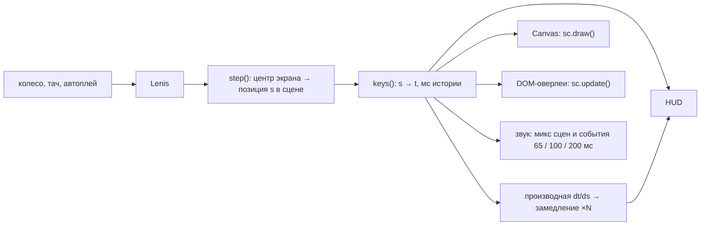

### Прокрутка как время
Каждая карточка занимает экран и называется шагом. Функция `step()` в `core.js` на каждом кадре переводит центр экрана в позицию `s` внутри текущей сцены, а кусочно-линейные ключевые кадры `keys` превращают её в время истории. Коэффициент замедления — это отношение реального времени к времени истории, если считать, что на один экран уходит `SEC_PER_STEP = 2,5` секунды:

```js
const s = clamp(sc.s, 0, sc.n);
t = keys(sc.keys, s);
const t2 = keys(sc.keys, clamp(s + 0.02, 0, sc.n));
const d = (t2 - t) / 0.02;
if (d > 1e-12) {
  const f = (SEC_PER_STEP * 1000) / d;
  const p = Math.pow(10, Math.floor(Math.log10(f)) - 1);
  factor = Math.max(1, Math.round(f / p) * p);
}
```

Самое сильное замедление — в «Эфире»: 33 нс полёта волны растянуты почти на экран прокрутки, отсюда ×68 000 000. Где время стоит, HUD пишет «время стоит». Видимость сцен плавно смешивается через smoothstep, поэтому соседние главы перетекают друг в друга без резких склеек. Обратная функция `A.yForTime()` находит позицию скролла по времени и обслуживает ссылки `#ms…`.

### Настоящее шифрование
`A.setMessage()` разбирает текст по кодовым точкам через `Array.from` (суррогатные пары эмодзи не рвутся), кодирует его `TextEncoder` и асинхронно шифрует. Ключ AES-GCM длиной 256 бит создаётся `crypto.subtle.generateKey` один раз на вкладку и помечен как неизвлекаемый; на каждое сообщение генерируется новый 12-байтовый nonce, к шифротексту добавляется 16-байтовый тег — отсюда «+28 байт» в карточке. Счётчик `encSeq` отбрасывает устаревшие результаты, если читатель печатает быстрее, чем завершается шифрование. Если `crypto.subtle` недоступен, страница показывает случайные биты той же длины и честно пишет об этом.

Модель пакета `A.pkt()` складывает минимальные заголовки: TLS 1.3 — 22 байта на запись, TCP — 20, IPv4 — 20, кадр Wi‑Fi с WPA2 — около 54. Доля «твоих слов» в посылке считается от реальной длины сообщения. Адреса в заголовках взяты из диапазонов для документации RFC 5737, имена хостов — в домене `.example`.

### Модель задержек и скорость света в стекле
Маршрут туда задан путевыми точками с временем прибытия: Москва 10 → Петербург 14 → Хельсинки 16,5 → Стокгольм 19,5 → Копенгаген 24 → Гамбург 27 → Франкфурт 32 (сервер до 36) → Лондон 40,5 → Бьюд 43 → Лонг-Айленд 74 → Нью-Йорк 75 → телефон Ани 100 мс. Обратный путь зеркален и заканчивается второй галочкой на 200 мс, первая появляется на 65 мс, когда ответ сервера из Франкфурта долетает до Москвы. Отрезки между точками — дуги большого круга (`d3.geoInterpolate`, 16 точек на отрезок и 90 на отрезки, примыкающие к Лонг-Айленду), положение пакета в момент `t` ищется по накопленной длине полилинии в `A.routeAt()`.

Опорная константа — скорость света в одномодовом волокне, 204 190 км/с (≈ c / 1,47). Из неё следуют «5 нс на метр стекла», 30–35 мс на Атлантику при 6–7 тыс. км кабеля и расчёты в песочнице: расстояние `d3.geoDistance × 6371 км`, делённое на эту скорость, даёт теоретический минимум, а реальные кабели и очереди дают коэффициент 1,5–2. Время по сценам — модель, а не запись конкретного пакета, и страница прямо об этом говорит.

### Карты: проекция на этапе сборки
Чтобы не проецировать контуры суши в браузере на каждом кадре, `tools/build-map.mjs` делает это заранее. Контуры Natural Earth из `world-atlas` пропускаются через поток `d3.geoPath` в собственный контекст, который записывает кольца уже в координатах готовой карты. Затем кольца упрощаются алгоритмом Рамера — Дугласа — Пекера, мелкие острова отбрасываются по площади, координаты округляются до десятых и сохраняются строками SVG-путей в `src/data/map-data.js`.

Карт три: детальная (50m) для маршрута в конической равноугольной проекции Ламберта с параллелями 40° и 62°, грубая (110m) в той же проекции для отъездов камеры и мировая в Equal Earth для песочницы. В браузере строки становятся `Path2D`, а проекция восстанавливается с теми же параметрами, чтобы города и маршрут совпали с сушей. Камера задаётся ключевыми кадрами `[долгота, широта, охват]`: позиция интерполируется со сглаживанием, охват — логарифмически, поэтому наезды выглядят равномерными. `A.drawLand()` рисует грубую подложку только за пределами детальной области через even-odd-клип.

### Генеративный звук
`audio.js` не содержит ни одного аудиофайла. Девять фоновых слоёв собираются из осцилляторов, белого и коричневого шума и фильтров: комната, шипение эфира, «стеклянный» звон волокна, вентиляторы, фон сети 50 Гц для Франкфурта и 60 Гц для Нью-Йорка, глубина океана, город и мягкий пэд. Для каждой сцены задан микс слоёв, веса смешиваются пропорционально видимости сцен и плавно подводятся `setTargetAtTime`. Поверх — события по времени истории: щелчок на каждой путевой точке, сигнал первой галочки на 65 мс, звон на 100 мс, аккорд на 200 мс и «свист» в повторе. Всё идёт через компрессор, а при скрытой вкладке звук приглушается.

### Сборка в один файл
`tools/build.mjs` использует только `node:fs`. Он достаёт из `src/template.html` части по маркерам `<!--HEAD-->`, `<!--BODY-->` и `<!--SCRIPTS-->`, встраивает `styles.css`, склеивает восемь JS-файлов в фиксированном порядке (данные карты, тексты, ядро, звук, сцены, функции, точка входа) в один `<script>`, экранирует `</script` и пишет два результата: самостоятельный `index.html` и `dist/artifact.html` — ту же страницу без обёрток `<html>`, `<head>` и `<body>` для публикации как артефакта claude.ai. В режиме артефакта открытка сохраняется через возможность `downloads`, в обычном браузере — через ссылку с атрибутом `download`.

## Дизайн

- **Палитра.** Ночь `#06080C` и `#0B1118`, сталь `#7F8C99`, туман `#A9B5C1` / `#E4E9EE`; «бумажные» листы `#E6E9EC` с чернилами `#0E1319` и `#46515D`. Смысловые цвета сквозные: янтарный `#FFB23F` (светлый `#FFD89A`, на бумаге `#8A4B00`) — сообщение, идущее туда, голубой `#62D2F5` (на бумаге `#0B6583`) — подтверждение, идущее обратно.
- **Типографика.** Source Serif 4 с оптическими размерами — текст, заголовки и гигантская «200» на заставке; Source Code Pro — числа, подписи, HUD и кикеры; системный UI-шрифт — только внутри макетов телефонов.
- **Сетка.** Один фиксированный Canvas на весь экран и карточки поверх. На десктопе карточки слева, визуальная зона справа (≈60 % ширины); на телефоне визуал занимает верхнюю половину, карточки прижаты к низу.
- **Одна тема без переключателя.** Ночные и бумажные листы чередуются по сюжету: завязка, дневной Нью-Йорк, финал и песочница сделаны на бумаге. Шапка и HUD меняют цвет автоматически по листу под ними.
- **Движение.** Плавная прокрутка Lenis, анимированное плёночное зерно из сгенерированной текстуры, собственный курсор-кольцо на устройствах с мышью, сюжетные изменения в сценах привязаны к прокрутке, а фоновая жизнь — мигание индикаторов, морской снег, рябь — идёт по времени.
- **Доступность.** При `prefers-reduced-motion` Lenis отключается, фоновая анимация сцен замораживается (изменения от прокрутки остаются), CSS-анимации гасятся. Есть ссылка «Перейти к началу истории», полная навигация с клавиатуры, `aria-live` для статусов и тостов, шкала HUD с ролью `slider`, модальная справка с возвратом фокуса, зоны касания 44 px на мобильных.
- **Два языка.** Все тексты лежат в `i18n.js` на русском и английском, язык определяется по `navigator.language` и переключается на лету; для русских форм используется `Intl.PluralRules` («1 байт», «3 байта», «5 байт»), числа форматирует `Intl.NumberFormat`.

## Управление

| Клавиша | Действие |
|---|---|
| `→` или `J` | Следующая глава или раздел |
| `←` или `K` | Предыдущая глава или раздел |
| `P` | «Смотреть»: автопрокрутка или пауза |
| `M` | Звук |
| `E` | Режим инженера |
| `L` | Русский или English |
| `?` | Список клавиш |
| `Esc` | Закрыть окно |
| `←` `→` `↑` `↓` на шкале HUD | Перемотка на 1 % истории |
| `PageUp` / `PageDown` на шкале HUD | Перемотка на 10 % |

Буквенные клавиши работают и в русской раскладке.

## Стек

| Технология | Версия | Для чего |
|---|---|---|
| JavaScript без фреймворков | — | Весь код, около 3 600 строк в семи модулях |
| Canvas 2D | — | Сцены, карты, повтор, песочница, открытка |
| d3-geo | 3.1.1 | Проекции, дуги большого круга, расстояния, сетка, обратная проекция для клика по карте |
| d3-array | 3.2.4 | Зависимость UMD-сборки d3-geo |
| Lenis | 1.3.26 | Плавная прокрутка |
| Web Audio API | — | Генеративный звук |
| Web Crypto API | — | Шифрование AES-256-GCM в браузере |
| Intl | — | Формы множественного числа и форматирование чисел |
| Node.js | — | Сборка в один файл и подготовка карт |
| topojson-client | 3.1.0 | Конвертация TopoJSON в GeoJSON при сборке карт |
| world-atlas | 2.0.2 | Контуры суши Natural Earth 50m и 110m |
| Google Fonts | — | Source Serif 4, Source Code Pro |

Библиотеки для браузера закреплены по версиям и грузятся с jsDelivr.

## Структура проекта

```
src/
  template.html     каркас страницы: части HEAD, BODY и SCRIPTS
  styles.css        все стили
  i18n.js           структура истории, тексты на русском и английском, источники
  core.js           утилиты, модель сообщения (UTF-8 + AES-GCM), раскладка,
                    прокрутка → время, цикл отрисовки, HUD
  audio.js          генеративные звуковые слои по сценам
  scenes-a.js       касание, буквы и шифр, конверты, эфир, свет
  scenes-b.js       эстафета, Франкфурт, погружение, Атлантика, Нью-Йорк, обратный путь
  features.js       чат и угадайка, квизы, гонка эпох, повтор, тест реакции,
                    песочница, открытка, автоплей, клавиши
  boot.js           точка входа
  data/map-data.js  сгенерированные контуры суши (Natural Earth через world-atlas)
tools/
  build-map.mjs     генерирует src/data/map-data.js
  build.mjs         собирает src/ в index.html и dist/artifact.html
index.html          готовая сборка, около 490 КБ
```

## Запуск

Готовый `index.html` лежит в репозитории: его можно открыть прямо в браузере или выложить на любой статический хостинг. Нужен интернет — библиотеки грузятся с jsDelivr, шрифты с Google Fonts. `crypto.subtle` и Clipboard API работают только в защищённом контексте (HTTPS или localhost); если они недоступны, история покажет случайные биты той же длины, а ссылку выведет текстом. Самый надёжный способ — локальный сервер:

```bash
python -m http.server 8000
# затем http://localhost:8000
```

Сборка из исходников требует Node.js:

```bash
npm install     # нужен только для npm run map
npm run map     # пересобрать src/data/map-data.js, только если меняется проекция или данные
npm run build   # записать index.html и dist/artifact.html
```

`npm run build` не зависит от пакетов из `node_modules`. Папка `dist/` в репозиторий не попадает.

## Источники

Время по сценам — модель, построенная из скорости света в волокне (≈204 000 км/с), реальных расстояний и типичных задержек оборудования. Факты сверены с источниками, которые перечислены и на самой странице:

- [ITU](https://www.itu.int/en/mediacentre/Pages/PR-2024-11-29-advisory-body-submarine-cable-resilience.aspx) — подводные кабели несут больше 99 % международного трафика
- [TeleGeography](https://resources.telegeography.com/how-many-submarine-cables-are-there-anyway) — сколько подводных кабелей и какой они длины
- [ICPC](https://www.iscpc.org/news/media-enquiries/) — 150–200 повреждений кабелей в год, толщина кабеля
- [Submarine Cable Map: Grace Hopper](https://www.submarinecablemap.com/submarine-cable/grace-hopper) — кабель Бьюд — Беллпорт (Лонг-Айленд)
- [DE-CIX Frankfurt](https://www.de-cix.net/en/locations/frankfurt) — больше 1 000 подключённых сетей
- [WonderNetwork](https://wondernetwork.com/pings/Moscow/Frankfurt) — реальные задержки Москва — Франкфурт
- [Corning SMF-28](https://www.corning.com/media/worldwide/coc/documents/Fiber/product-information-sheets/PI-1424-AEN.pdf) — скорость света в волокне и размеры волокна
- [NOAA](https://oceanservice.noaa.gov/facts/light_travel.html) — как глубоко свет проникает в океан
- [Wreck of the Titanic](https://en.wikipedia.org/wiki/Wreck_of_the_Titanic) — глубина, на которой лежит «Титаник»
- [IEEE Spectrum](https://spectrum.ieee.org/the-first-transatlantic-telegraph-cable-was-a-bold-beautiful-failure) — первый трансатлантический телеграф, 1858
- [60 Hudson Street](https://en.wikipedia.org/wiki/60_Hudson_Street) — от Western Union до узла интернета
- [BioNumbers](https://bionumbers.hms.harvard.edu/bionumber.aspx?id=100706) — сколько длится моргание
- [TechCrunch](https://techcrunch.com/2020/10/29/whatsapp-is-now-delivering-roughly-100-billion-messages-a-day/) — WhatsApp доставляет около 100 млрд сообщений в день (2020)
- [RFC 3629](https://www.rfc-editor.org/rfc/rfc3629) — кодировка UTF-8
- [RFC 5737](https://www.rfc-editor.org/rfc/rfc5737) — адреса для документации, использованные в примерах
- [world-atlas](https://github.com/topojson/world-atlas) — контуры суши Natural Earth

---

Концепт-проект, 2026. Аня и её телефон — персонажи; адреса, имена узлов и маршрут условные, настоящий пакет каждый раз выбирает путь сам.
